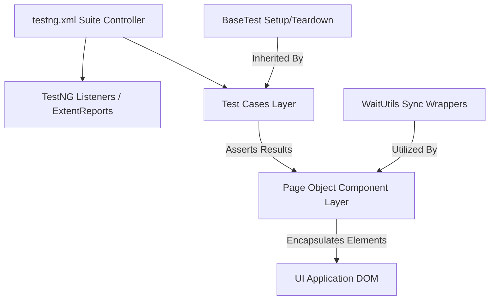

Here is your enhanced, production-ready, and highly polished `README.md`. It has been completely re-architected with cohesive, vibrant GitHub markdown badges, clear data comparison grids, interactive dropdown accordions for scannability, and technical terminology that highlights your skills as an automation engineer.

---

```markdown
# 🚀 WIPRO SDET Capstone Automation Framework

[](https://www.oracle.com/java/)
[](https://www.selenium.dev/)
[](https://testng.org/)
[](https://maven.apache.org/)
[](https://www.jenkins.io/)

This repository serves as a centralized, production-grade archive of hands-on technical solutions, programmatic challenges, and modular automation architectures completed during the **Wipro Software Development Engineer in Test (SDET) NGA Training Program**. 

This project is a highly scalable **Selenium Automation Framework** built to execute robust end-to-end user journeys across diverse, modern web applications. Utilizing a modular, clean-coded infrastructure, this framework ensures elevated test coverage, zero-maintenance test scripts, and dynamic graphical analytics reports optimized for enterprise continuous integration pipelines.

---

## 🛠️ Tech Stack & Enterprise Dependencies

| Layer | Component | Technical Focus & Capabilities |
| :--- | :--- | :--- |
| **Core Language** | `Java (JDK 11 / 17 / 21)` | Object-Oriented Design, Collections Engine, and Strong Typing. |
| **Web Automation** | `Selenium WebDriver (v4.x)` | W3C WebDriver Protocol compliance, Dynamic DOM Interrogation. |
| **Test Orchestration** | `TestNG` | Parallel Execution Matrices, Assertions, Parameterization, and Listeners. |
| **Build Management** | `Apache Maven` | Project Object Model (`pom.xml`) lifecycle management & dependency pipelines. |
| **Driver Engine** | `WebDriverManager` | Automated, hands-free browser binary configuration and caching. |
| **Reporting Analytics** | `Extent Reports` | Rich HTML5 interactive test execution dashboards, logging, and metrics. |
| **Version Control** | `Git & GitHub` | Distributed code configuration management and branch version tracking. |
| **CI/CD Orchestration** | `Jenkins` | Infrastructure-as-Code execution using declarative `Jenkinsfile` pipelines. |

---

## 🏗️ Architectural Design Pattern: Page Object Model (POM)

To eliminate code duplication, minimize regression brittle-points, and enhance read-flows, the framework strictly adheres to the **Page Object Model (POM)** design pattern.



* 🧩 **Complete Separation of Concerns:** Web UI fields and interactive actions are completely isolated inside Page Classes, remaining fully decoupled from actual validation-driven Test Cases.
* 🛠️ **Seamless Framework Maintainability:** UI adjustments on target web platforms require single-point updates inside corresponding Page Classes, protecting test suites from cascading failures.
* 🔒 **Strict Data Encapsulation:** Web elements are compiled securely using `@FindBy` annotations and exposed strictly through descriptive, public action methods.

---

## 📂 Project Structure & Directory Layout

The workspace aligns with standardized Apache Maven directory conventions, compartmentalizing components to maximize modularity:

```text
src/test/java
├── base/
│   └── BaseTest.java                  # Infrastructure setup (Browser factory, explicit sync engines, teardowns)
│
├── pages/                             # Page Object Classes encapsulating elements and actions
│   ├── GUI Element Pages              # Advanced selectors handling non-standard dynamic HTML controls
│   ├── ParaBank Pages                 # Components for user authentication, registration, and dashboards
│   └── BlazeDemo Pages                # Selectors for e-commerce flight search, selection, and checkouts
│
├── testcases/                         # Executable test layers mapping TestNG assertions to page interactions
│   ├── GuiElementsTest.java           # Multi-layered validations for interactive components
│   ├── ParaBankRegistrationTest.java  # Complex state validation for registration and active user sessions
│   └── BlazeDemoTest.java             # End-to-end transactional funnel checkout tracking
│
├── utilities/
│   └── WaitUtils.java                 # Custom explicit, fluent, and conditional UI synchronization layers
│
├── reports/
│   └── ExtentManager.java             # Thread-safe reporting compilation engine for Extent Reports
│
└── listeners/
    └── TestListener.java              # TestNG real-time runtime monitors capturing pass/fail states

```

---

## 🧪 Detailed Automation Scenarios & Test Coverage

* **Standard Controls Architecture:** Validation of standard input streams, native and absolute radio button groups, and multi-state checkbox arrays.
* **Dynamic Select Engine:** Multi-option evaluations using native `Select` wrappers as well as dynamic asynchronous bootstrap elements.
* **Advanced Synchronization:** Elimination of flaky tests via `WaitUtils.java` leveraging explicit condition criteria to track AJAX calls and loading rings.
* **Complex Desktop User Interactions:** Mouse hover structures, continuous drag-and-drop movements, and custom offset sliding actions using the `Actions` class.
* **Deep DOM Interrogation:** Extraction of encapsulated elements within complex Shadow DOM spaces and automated handling of nested tables.
* **Window & Frame Controls:** Interactive management of javascript prompt fields, modal windows, multi-tab routing, and multi-layered iframes.

* **Dynamic Data Isolation:** Runtime generation of randomized string prefixes for username entries to guarantee zero collision failures across database tests.
* **Provisioning Flows:** Programmatic processing of multi-field sign-up modules, validating welcome page layouts and teardown sessions.
* **Session Validation:** Confirming system persistence by re-logging with fresh runtime parameters to evaluate landing page security parameters.

* **Parametric Flight Routing:** Evaluating flights by passing varied city departure matrices into targeted interface forms.
* **Dynamic Evaluation Matrices:** Running on-the-fly table parsing to isolate and confirm flight cost rows.
* **Checkout Pipeline Integration:** Verification of transactional workflows with mocked passenger details and checkout structures.
* **Receipt Engine Verification:** Scraping final confirmation summaries to assert transaction IDs, financial tallies, and validation outcomes.

---

## ✨ Framework Engineering Features

* 🔄 **Thread-Safe Synchronization:** Powered by custom `WaitUtils.java` wrappers, checking element visibility, clickability, and page readiness to eliminate synchronization discrepancies.
* 🎛️ **Centralized Suite Controller:** Execution matrices are managed via `testng.xml`, supporting parallel execution tracks, test category groupings, and browser-type injections.
* 📡 **Smart Runtime Execution Listeners:** Configured with custom `TestListener.java` hooks that intercept test states to log execution paths and aggregate real-time metrics on failure events.

---

## 📊 Comprehensive Reporting Strategy

Test runs generate clean HTML visual dashboards stored directly inside the workspace target directories:

```text
test-output/
└── ExtentReport.html

```

### Analytical Capabilities Highlight:

* **High-Level Dashboard Views:** Visually striking graphical pie charts breaking down passed, skipped, and failed modules at a single glance.
* **Granular Trace Logs:** Step-by-step recording of explicit actions accompanied by exact milisecond timestamps for precision logging.
* **Failure Point Isolation:** Automatic tracking and insertion of system exception stack traces inside dashboard panels to streamline debugging.

---

## ⚙️ How to Set Up and Execute Locally

### Local Environment Prerequisites

* **Java Kit:** JDK 11 or higher installed and added to your environment paths (`JAVA_HOME`).
* **Build Engine:** Apache Maven setup with binaries declared within system environment profiles (`M2_HOME`).
* **IDE:** Eclipse IDE for Enterprise Java Developers or IntelliJ IDEA.

### Local Step-by-Step Deployment

1. **Clone the Repository Source:**

```bash
   git clone [https://github.com/thejolly911/Wipro-SDET_CapstoneProject.git](https://github.com/thejolly911/Wipro-SDET_CapstoneProject.git)
   cd Wipro-SDET_CapstoneProject

```

2. **Workspace Import Workflow:**
* Launch your Eclipse IDE environment.
* Click **File** $\rightarrow$ **Import** $\rightarrow$ **Maven** $\rightarrow$ **Existing Maven Projects**.
* Browse and select your root cloned folder directory, then select **Finish**.


3. **Synchronize System Project Dependencies:**
* Right-click project root directory $\rightarrow$ **Maven** $\rightarrow$ **Update Project...** $\rightarrow$ Check **Force Update** $\rightarrow$ Click **OK**.


4. **Trigger Suite Execution:**
* Locate the global control file `testng.xml` inside the framework root layout.
* Right-click `testng.xml` $\rightarrow$ **Run As** $\rightarrow$ **TestNG Suite**.


---

## 🚀 Continuous Integration (CI/CD) Jenkins Pipeline

The framework is fully containerization-ready and includes a production-configured declarative `Jenkinsfile` pipeline script to manage deployments.

```text
[SCM Pull] ──> [Env Verification] ──> [Test Execution (Headless)] ──> [Artifact Archiving]

```

### Core Execution Stages:

1. **Source Code Management (SCM):** Automated tracking hooks poll and download code alterations pushed to the repository's `main` branch.
2. **Environment Verification:** Validates that active system agents match runtime JDK and Maven paths before compiling source configurations.
3. **Execution Engine Phase:** Compiles underlying code assets and processes active suites using headless browser setups via specialized terminal commands:

```bash
   mvn clean test

```

4. **Post-Build Artifact Handling:** Gathers all produced `ExtentReport.html` files, moving them to the Jenkins Build History pipeline dashboards for long-term regression tracking.

---

## ✍️ Author Profile

* **Arya Kumar Dash**
* **Role Track:** Software Development Engineer in Test (SDET)
* **Program Alignment:** *Wipro Next-Gen Academic (NGA) Capstone Automation Initiative*

```

```
